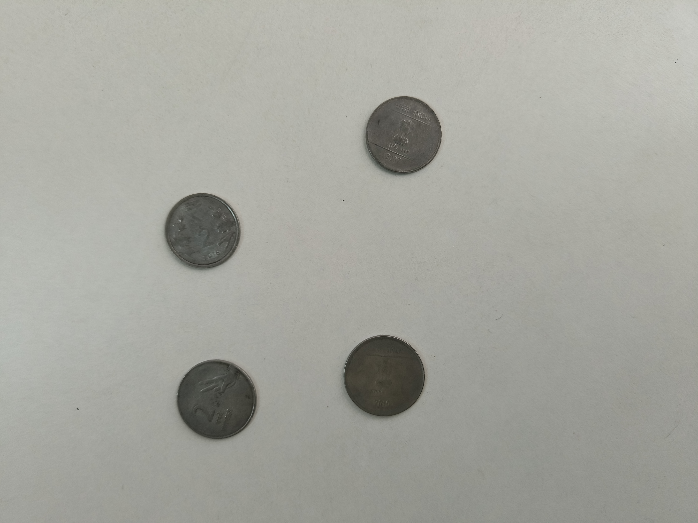
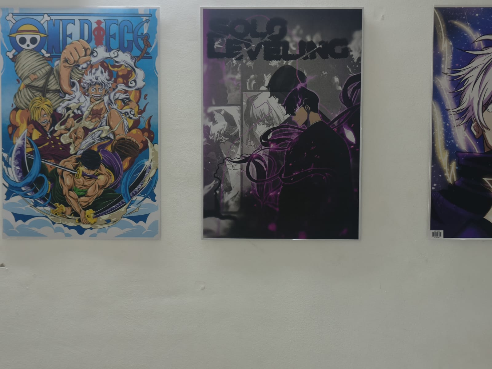
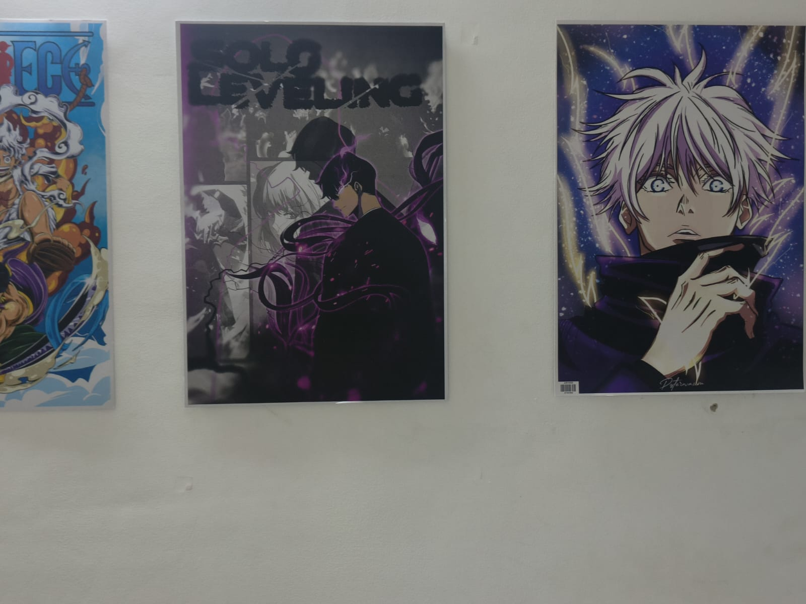

# Coin Detection and Image Stiching

## Overview

This project consists of two parts:

1. **Coin Detection, Segmentation, and Counting**  
   - Detect coins using edge detection.  
   - Segment individual coins using region-based segmentation.  
   - Count the total number of detected coins.  

2. **Image Stitching for Panorama Creation**  
   - Detect key points in overlapping images.  
   - Use homography to align and stitch images into a panorama.  

## Part 1: Coin Detection, Segmentation, and Counting

This section detects, segments, and counts Indian coins in an image.  

### **Steps Involved**  
1. **Edge Detection (Contours Method)**  
   - Converts the image to grayscale.  
   - Applies Gaussian Blur and Canny edge detection.  
   - Finds contours to detect coin boundaries.  
   - Outlines detected coins in green.  

2. **Segmentation**  
   - Converts the image to grayscale and applies Gaussian Blur.  
   - Uses Otsu's thresholding to generate a binary mask.  
   - Applies morphological operations to clean noise.  
   - Detects and labels connected components for segmentation.  

3. **Counting Coins**  
   - The total number of detected coins is displayed in the terminal.  

### Requirements  
Install the required dependencies using:  
```bash
pip install opencv-python numpy scikit-image matplotlib
```

### How to Run  
Place your input image in the `input_images/` folder and update the image path in `1.py`. Then, run:  
```bash
python 1.py
```

### Methods Used
- **Edge Detection & Contours**: Used Canny edge detection to find coin contours.
- **Segmentation**: Applied Gaussian blur, Otsu’s thresholding, and morphological operations to separate coins.
- **Counting**: The total number of coins is determined using contours and labeled regions.

### Example Inputs & Outputs  

#### Input Image:


#### Canny Edge Detection Output:


#### Contour Detection Output:


#### Segmentation Output:


---

## Part 2: Image Stitching

This section stitches overlapping images into a single panorama.  

### **Steps Involved**  
1. **Feature Detection & Matching**  
   - Uses **SIFT (Scale-Invariant Feature Transform)** to extract keypoints.  
   - Matches keypoints using **Brute-Force Matcher (BFMatcher)**.  
   - Filters and sorts matches based on distances.  

2. **Homography & Warping**  
   - Computes the homography matrix using **RANSAC**.  
   - Warps one image onto another to align them.  
   - Creates a seamless panorama. 

### Requirements  
Install dependencies:  
```bash
pip install opencv-python numpy
```

### How to Run  
Place overlapping images in the `input_images/` folder and update the image paths in `2.py`. Then, run:  
```bash
python 2.py
```

### Methods Used
- **Feature Detection**: Used SIFT to extract key points.
- **Matching**: Used Brute-Force Matcher with L2 norm.
- **Homography & Warping**: Computed homography to align images.

### Example Inputs & Outputs  

#### Input Images:



#### Keypoints Detected:


#### Final Stitched Panorama:


---

## Folder Structure  
```
vr_assignment1_Koushik_IMT2022570/
│── input_images/
│   ├── coins.jpg
│   ├── overlap_image_1.jpg
│   ├── overlap_image_2.jpg
│── output_images/
│   ├── canny_edges.jpg
│   ├── contours_detected.jpg
│   ├── segmented_coins.jpg
│   ├── keypoints_1.jpg
│   ├── keypoints_2.jpg
│   ├── panorama_output.jpg
│── 1.py  (Coin Detection & Segmentation)
│── 2.py  (Panorama Stitching)
│── README.md
```


## **Results & Observations**  

### **Coin Detection & Segmentation**  
- Successfully detects **coin edges** using Canny edge detection and contour detection.  
- Effectively **segments individual coins** using thresholding and morphological operations.  
- **4 coin segments** were detected and displayed in the terminal output.  

### **Image Stitching**  
- **SIFT keypoints** are accurately detected in both input images.  
- **Feature matching** using BFMatcher successfully finds corresponding keypoints.  
- The final **panorama seamlessly combines two images** using homography and RANSAC.  

